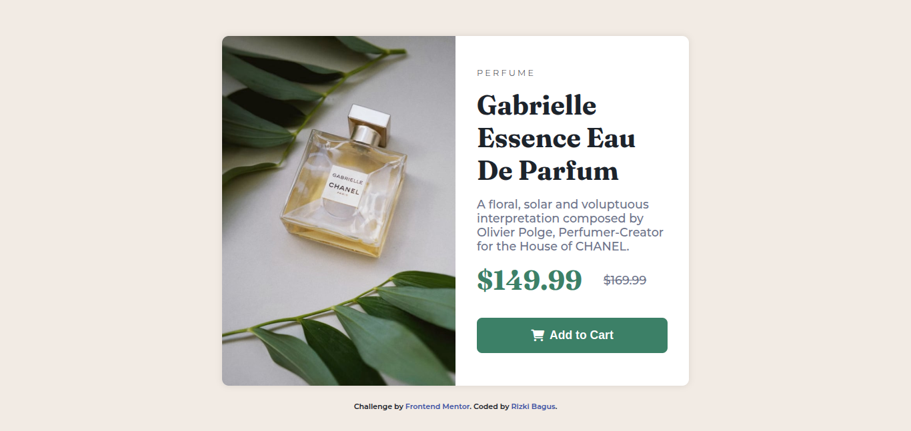

# Frontend Mentor - Product preview card component solution

This is a solution to the [Product preview card component challenge on Frontend Mentor](https://www.frontendmentor.io/challenges/product-preview-card-component-GO7UmttRfa). Frontend Mentor challenges help you improve your coding skills by building realistic projects. 

## Table of contents

- [Overview](#overview)
  - [The challenge](#the-challenge)
  - [Screenshot](#screenshot)
  - [Links](#links)
- [My process](#my-process)
  - [Built with](#built-with)
  - [What I learned](#what-i-learned)
- [Author](#author)


## Overview

### The challenge

Users should be able to:

- View the optimal layout depending on their device's screen size
- See hover and focus states for interactive elements

### Screenshot




### Links

- Solution URL: [Add solution URL here](https://github.com/rizkibagus/product-preview-card)
- Live Site URL: [Add live site URL here](https://rizkibagus.github.io/product-preview-card/)

## My process

### Built with

- Semantic HTML5 markup
- CSS custom properties
- Flexbox
- Mobile-first workflow

### What I learned

In this project, i learn how to build this from mobile-first workflow.

To see how you can add code snippets, see below:

```html
 <section class="product">
      <!-- Image Desktop -->
      
      <!-- Image Mobile -->
      
      
      <div class="product-description">
        <h1>Perfume</h1>
        <h2>Gabrielle Essence Eau De Parfum</h2>
        <p>
          A floral, solar and voluptuous interpretation composed by Olivier
          Polge, Perfumer-Creator for the House of CHANEL.
        </p>
        <div class="price">
          <p class="price-now">$149.99</p>
          <p class="price-before">$169.99</p>
        </div>
        <button><i class="fas fa-shopping-cart"></i> Add to Cart</button>
      </div>
    </section>
```
```css
:root {
    --primarydarkcyan:  hsl(158, 36%, 37%);
    --primarycream:  hsl(30, 38%, 92%);
    --neutraldarkblue: hsl(212, 21%, 14%);
    --neutralgrayishblue: hsl(228, 12%, 48%);
    --white: hsl(0, 0%, 100%);
}

* {
    margin: 0;
    padding: 0;
    box-sizing: border-box;
}

body {
    font-family: 'Montserrat', sans-serif;
    background-color: var(--primarycream);
    color: var(--neutraldarkblue);
    display: flex;
    flex-direction: column;
    align-items: center;
    justify-content: center;
    min-height: 100vh;
}

.product {
    max-width: 375px;
    margin: 1.5rem 0;
    border-radius: 10px;
    background-color: var(--white);
    box-shadow: 0 0 10px rgba(0, 0, 0, 0.1);
}

.product img.image-desktop {
    display: none;
}


.product img.image-mobile {
    width: 100%;
    margin-bottom: 1rem;
    border-radius: 10px 10px 0 0;
    background-position: center;
    background-size: cover;
    background-repeat: no-repeat;
    object-position: center;

}

.product .product-description {
    padding: 0 1.5rem 1.5rem 1.5rem;
}

.product .product-description h1 {
    font-size: 0.7rem;
    font-weight: 300;
    margin-bottom: 0.3rem;
    text-transform: uppercase;
    letter-spacing: 0.2rem;
    
}

.product .product-description h2 {
    font-family: 'Fraunces' , serif;
    font-size: 2.3rem;
    font-weight: 700;
    margin-bottom: 1rem;   
}

.product .product-description p {
    font-size: 1rem;
    font-weight: 500;
    margin-bottom: 1rem;
    color: var(--neutralgrayishblue);
}

.product .product-description .price {
    display: flex;
    gap: 1rem;
    align-items: center;
}

.product .product-description .price p.price-now {
    font-family: 'Fraunces' , serif;
    color: var(--primarydarkcyan);
    font-size: 2.3rem;
    font-weight: 700;
}

.product .product-description .price p.price-before{
    text-decoration: line-through;
    color: var(--neutralgrayishblue);
}

.product .product-description button {
  display: flex;
  align-items: center;
  justify-content: center;
  border: none;
  cursor: pointer;
  background-color: var(--primarydarkcyan);
  width: 100%;
  color: var(--white);
  font-size: 1rem;
  font-weight: 700;
  padding: 1rem 0; 
  gap: 0.5rem;
  border-radius: 0.5rem;
  transition: all 0.3s;
}

.product .product-description button:hover{
    background-color: var(--neutraldarkblue);
}


/* Footer */

.attribution {
    font-size: 11px;
    text-align: center;
    font-weight: 600;
  
  }
  .attribution a {
    color: hsl(228, 45%, 44%);
    text-decoration: none;
  }


  @media (min-width: 768px) {
    body {
        background-image: url('../images/bg-pattern-desktop.svg');
        background-size: cover;
        background-position: center;
        background-repeat: no-repeat;
    }

    .product {
        display: flex;
        max-width: 700px;
        border-radius: 10px;
        background-color: var(--white);
        box-shadow: 0 0 10px rgba(0, 0, 0, 0.1);
    }

    .product img.image-desktop {
        display: block;
        width: 50%;
        border-radius: 10px 0 0 10px;
    }

    .product img.image-mobile {
        display: none;
    }

    .product .product-description {
        padding: 3rem 2rem;
    }

    .product .product-description h1 {
        font-size: 0.8rem;
        margin-bottom: 1rem;
    }

    .product .product-description h2 {
        font-size: 2.5rem;
        margin-bottom: 1rem;
    }

    .product .product-description p {
        font-size: 1.1rem;
        margin-bottom: 1rem;
    }
    
    .product .product-description .price {
        gap: 2rem;
        margin-bottom: 1rem;
    }

    .product .product-description .price p.price-now {
        font-size: 2.5rem;
    }

    .product .product-description .price p.price-before {
        font-size: 1.1rem;
    }

    .product .product-description button {
        font-size: 1.1rem;
    }
  }
```

## Author

- Website - [Portfolio](https://rizkibagus.github.io/portfolio/)
- Frontend Mentor - [@rizkibagus](https://www.frontendmentor.io/profile/rizkibagus)
- Twitter - [@bagus_dev](https://www.twitter.com/bagusdev_)

